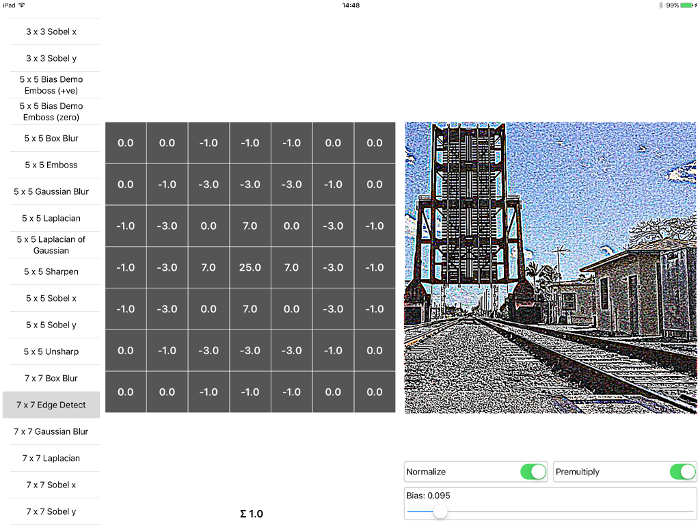

# CoreImageConvolutionExplorer
Core Image Convolution Explorer

An iPad app to explore 28 different convolution kernels including blurs, edege detections and embosses. The app includes controls for normalizing the weight values and setting bias. It also includes a toggle to either premultiply or unpremultiply colors when making opaque.

This project is a companion to the convolution chapter of my book, *Core Image For Swift*. The book is available from:

* [*Core Image for Swift* from iBooks Store](https://itunes.apple.com/us/book/core-image-for-swift/id1073029980?mt=13)
* [*Core Image For Swift* from Gumroad](https://gumroad.com/l/CoreImageForSwift)
